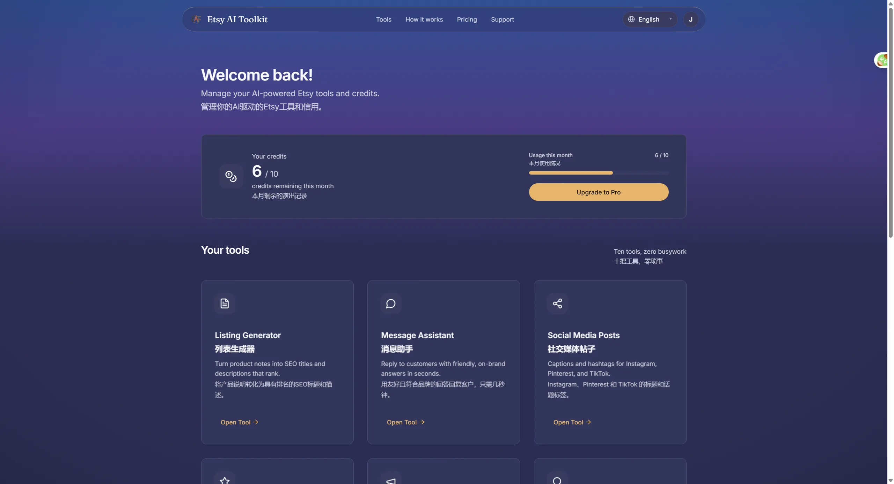
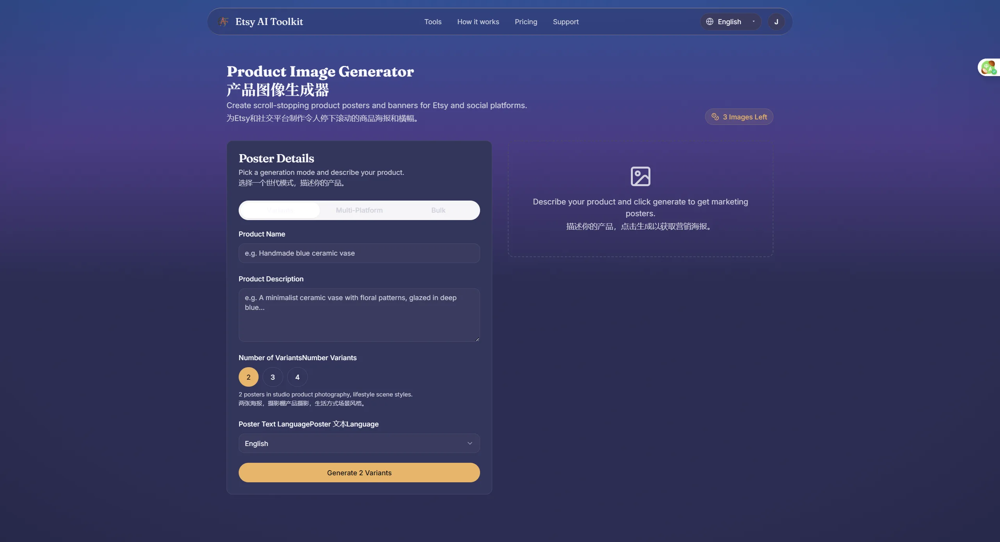

<p align="center">
  
</p>

<h1 align="center">Etsy AI Toolkit</h1>

<p align="center">
  <strong>The AI copilot for Etsy sellers.</strong><br />
  Write listings, reply to buyers, generate product posters, and price to profit — from one dashboard.
</p>

<p align="center">
  <a href="https://craftly.world"></a>
  <a href="https://nextjs.org"></a>
  
  
  <a href="https://supabase.com"></a>
  <a href="https://paddle.com"></a>
  <a href="https://vercel.com"></a>
  
  
</p>

---

## What it is

Etsy AI Toolkit is a production SaaS (live at **[craftly.world](https://craftly.world)**) that removes the busywork from running an Etsy shop. Ten AI tools cover the full listing lifecycle — from first draft, through buyer conversation and reviews, to SEO, translation, and product photography. Free tier gives you **10 credits + 3 generated images** with no card, so you can try everything before paying.

- **OTP sign-in** — passwordless email login via Supabase Auth (6-digit code).
- **Credit + image quotas** — every generation is metered; tiers unlock more.
- **4-tier billing** — powered by Paddle (checkout, customer portal, webhooks).
- **Multi-provider AI** — a primary chat relay with automatic fallback, a vision model for image translation, and a dedicated image-generation model for posters.
- **MCP server** — a Model Context Protocol server exposes the toolkit to Claude and other MCP clients.
- **Batch image generation** — poster variants, per-platform sizes, or a bulk product list, all generated in one run.
- **One-click language switcher** — flip the entire UI between 7 languages (en / de / fr / es / zh / ja / it) instantly.

<p align="center">
  
</p>

## The 10 tools

| Tool | What it does |
| --- | --- |
| **Listing Generator** | SEO-optimized title, description, and 13 Etsy tags from your product details |
| **Message Reply** | Three professional replies to any buyer message, in your brand voice |
| **Review Reply** | Rating-aware review responses that keep your 5-star reputation intact |
| **Social Post** | Captions + hashtags tuned for Instagram, Pinterest, TikTok, Facebook, and X |
| **Shop Announcement** | Sales, restocks, or holiday notices written in your tone |
| **Keyword Generator** | 15 high-volume, long-tail keywords for search and ads |
| **Listing Optimizer** | Rewrites an existing listing and explains exactly what it improved |
| **Pricing Advisor** | Suggested price and profit margin from your costs and competitors |
| **Translate** | Translates listing text **or images** (vision OCR) while preserving SEO keywords |
| **Product Image Generator** | AI-generated product posters and banners (see below) |

### Product image generator

Three batch modes share one backend (`POST /api/generate-images`), so you never wait for one poster at a time:

- **Variants** — 2–4 different-styled posters of the same product (Etsy listings want multiple images).
- **Multi-platform** — one poster per platform size (Etsy / Instagram / Pinterest / TikTok / YouTube / Facebook).
- **Bulk** — paste a list of products, get one poster each.

Each poster consumes 1 image credit, deducted per generated image.

<p align="center">
  
</p>

## Pricing

| Tier | Monthly | Yearly | Credits | Images |
| --- | --- | --- | --- | --- |
| **Free** | — | — | 10 | 3 |
| **Basic** | $9 | $79 | 100 | 20 |
| **Pro** | $19 | $179 | 300 | 60 |
| **Scale** | $39 | $349 | 1000 | 300 |

## MCP server

A Model Context Protocol server (`mcp-server/`) exposes the toolkit to any MCP client (Claude, Cursor, etc.). It ships with **dual transport** — stdio and Streamable HTTP — and a dedicated service-account auth (`x-mcp-key`).

| Tool | Purpose |
| --- | --- |
| `generate_listing` | Create a listing (title / description / tags) |
| `generate_message_reply` | Draft buyer message replies |
| `generate_review_reply` | Respond to reviews |
| `generate_social_post` | Write social captions + hashtags |
| `generate_announcement` | Write shop announcements |
| `generate_keywords` | Generate keywords |
| `translate_listing` | Translate listing text |
| `optimize_listing` | Improve an existing listing |
| `generate_pricing_advice` | Suggest pricing and margins |
| `get_credits` | Check remaining credits |

Published to npm as [`etsy-ai-toolkit-mcp`](https://www.npmjs.com/package/etsy-ai-toolkit-mcp):

```bash
npm install -g etsy-ai-toolkit-mcp
etsy-ai-toolkit-mcp          # stdio
etsy-ai-toolkit-mcp-http     # Streamable HTTP
```

Or run from source:

```bash
cd mcp-server
npm install
npm run build
npm start          # stdio
npm run start:http # Streamable HTTP
```

## Tech stack

| Layer | Choice |
| --- | --- |
| Framework | Next.js 14 (App Router), TypeScript |
| Styling | Tailwind CSS, shadcn/ui + Radix UI, Framer Motion |
| Auth | Supabase Auth (OTP, SSR) |
| Database | Supabase (Postgres + RLS) |
| Billing | Paddle (checkout, portal, webhooks) |
| Email | Resend (welcome, subscription lifecycle) |
| AI | Multi-provider — primary chat relay with automatic fallback · vision model · image-generation model |
| i18n | Lightweight custom framework, 7 locales (en / de / fr / es / zh / ja / it) |
| MCP | @modelcontextprotocol/sdk, 10 tools |

## Getting started

### Prerequisites

- Node.js 18+
- A [Supabase](https://supabase.com) project
- An LLM provider API key (OpenAI-compatible)
- (Optional) Paddle + Resend keys for billing and email

### 1. Install

```bash
npm install
```

### 2. Configure environment variables

Create a `.env.local` in the project root:

```bash
NEXT_PUBLIC_SUPABASE_URL=your_supabase_url
NEXT_PUBLIC_SUPABASE_ANON_KEY=your_supabase_anon_key
OPENAI_API_KEY=your_llm_api_key
# Optional: override the LLM base URL (custom gateway/proxy)
OPENAI_BASE_URL=
```

### 3. Set up the database

Apply the migrations in `supabase/migrations/` (SQL Editor or `supabase db push`). They cover the schema, Row Level Security, the signup trigger, and the pricing/image-quota gradient.

### 4. Run

```bash
npm run dev
```

Open [http://localhost:3000](http://localhost:3000).

## Environment variables

| Variable | Required | Description |
| --- | --- | --- |
| `NEXT_PUBLIC_SUPABASE_URL` | Yes | Supabase project URL |
| `NEXT_PUBLIC_SUPABASE_ANON_KEY` | Yes | Supabase anonymous key |
| `OPENAI_API_KEY` | Yes | Primary LLM API key |
| `OPENAI_BASE_URL` | No | Override the LLM base URL (custom gateway/proxy) |
| `USE_MOCK_AI` | No | Set `true` to run without calling any LLM API |

> API keys are used **server-side only** and never reach the browser. Never commit `.env.local`.

## Database

Schema lives in `supabase/migrations/`:

- `profiles` — one row per user; tracks `credits_remaining`, `images_remaining`, subscription status, and brand prefs
- `generations` — a log of every AI generation
- `handle_new_user()` trigger — auto-creates a profile row on signup (with the Free quota)
- Row Level Security policies on all tables

## Project structure

```
app/
  (auth)/             # OTP login / signup
  api/                # AI generation, billing, image routes
  dashboard/          # the 10 tool pages
components/
  dashboard/images/   # image generator (hook, panels, result grid)
  ui/                 # shadcn/ui primitives
lib/
  auth.ts             # request auth + tier/image access
  openai.ts           # multi-provider AI + image generation
  pricing.ts          # tier/price definitions
  email.ts            # Resend email helpers
  i18n/               # lightweight i18n framework
mcp-server/           # MCP server (stdio + Streamable HTTP)
supabase/
  migrations/         # SQL schema migrations
```
